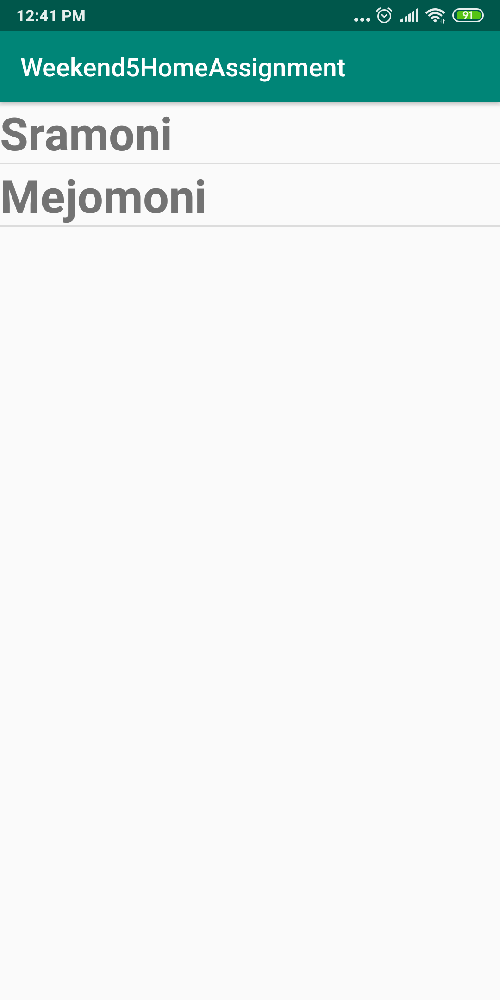
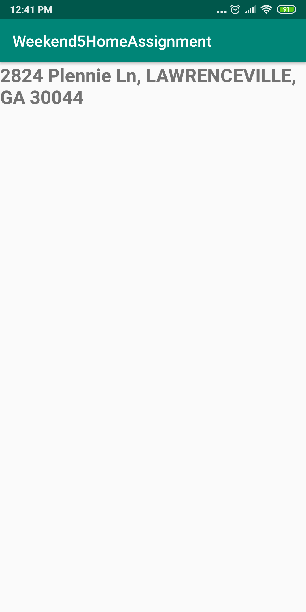
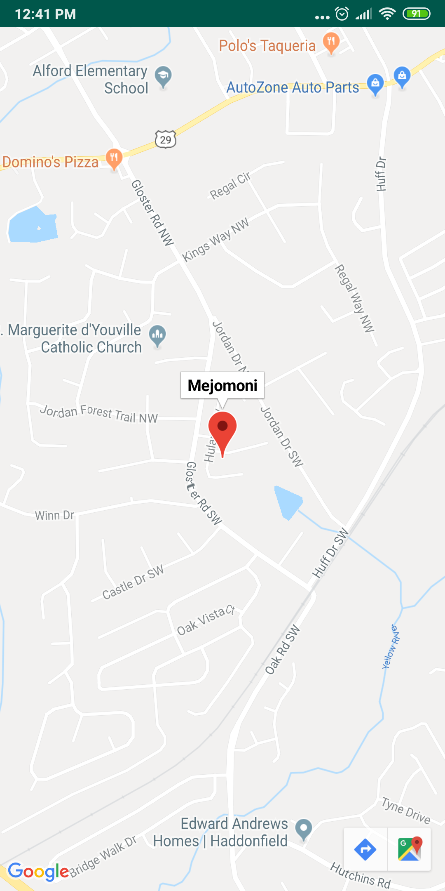

# Weekend5HomeAssignment
An app that will pull the locations from the Contacts system content provider and display them to a recycler view.  Upon clicking on any contact, display the details of the contact.  In your contacts on your device, give a few a address.  On the details view, if the user clicks the address, open a maps activity and show the location of that address on the map.

Getting contacts which have address in a recyclerView;

After selecting a contact, details is shown. 

Upon clicking the location, address is shown in Google Map

